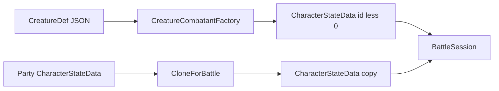

# Как использовать Creatures (статблоки противников)

**Последнее обновление:** 2026-07-28 16:40:00 (+03:00)

Практическое руководство: как описывать противников (`CreatureDef`) и превращать их в боевых combatant’ов (`CharacterStateData`) через `CreatureCombatantFactory`.

Связанные документы: [Definitions.md](Definitions.md) (`CreatureDef`), [State.md](State.md) (`CreatureCombatantFactory`, `CharacterStateData`), [Battle.md](Battle.md) (combatants / session), [Feats.md](Feats.md) (Apply/Unapply на том же shape).

---

## Идея в одном абзаце

`CreatureDef` — **авторский статблок** (как в руководстве по монстрам): AC, HP, abilities, Perception, сейвы, ключевые скиллы, Features, экип, `BattleActionIds`, класс опасности.  
В бою партия и противники — **один и тот же** `CharacterStateData`, чтобы `ApplyFeat` / `UnapplyFeat` / `EndCharacterTurn` / proxies работали одинаково.  
Связка: `CreatureDef` → **`CreatureCombatantFactory.CreateFromCreature`** → session-`CharacterStateData` с **отрицательным** id.



---

## Базовый API

| Вызов | Когда |
|-------|--------|
| `CreatureCombatantFactory.CreateFromCreature(def, instanceId, definitionsManager)` | Спавн NPC из статблока; `instanceId < 0` |
| `CreatureCombatantFactory.CloneForBattle(partyMember)` | Копия героя в session (не мутировать сейв mid-combat) |
| `CharacterParametersOperator.ApplyFeat(combatant, featId, …)` | Статусы / дебафы — **и** на игрока, **и** на NPC |
| `definitionsManager.Creatures[id]` | Lookup статблока после `LoadAll` |

Factory **не** пишет в `CharactersStateData` профиля и **не** трогает `NextCharacterId`.

---

## Пример использования (C#)

```csharp
// 1) Противник из статблока (session id: -1, -2, …)
CreatureDef goblinDef = definitionsManager.Creatures["_GoblinWarrior"];
CharacterStateData goblin = CreatureCombatantFactory.CreateFromCreature(
    goblinDef,
    instanceId: -1,
    definitionsManager);

// 2) Копия члена партии для боя
CharacterStateData heroInBattle = CreatureCombatantFactory.CloneForBattle(
    state.Characters.Characters[heroId]);

// 3) Тот же Write API статусов для обеих сторон
CharacterParametersOperator.ApplyFeat(goblin, "_ConditionFrightened", definitionsManager);
CharacterParametersOperator.ApplyFeat(heroInBattle, "_ConditionFrightened", definitionsManager);

// 4) Чтение итогов (MaxHP / навыки) через proxy — как у героя
var proxy = new CharacterParametersProxy(goblin, ruleDef, definitionsManager);
int maxHp = proxy.GetTotalValue(Glossary.Characters.MAX_HIT_POINTS);
int stealth = proxy.GetTotalValue(Glossary.Characters.STEALTH);

// 5) Действия NPC — с дефа (не копируются в CharacterStateData)
List<string> actions = goblinDef.BattleActionIds; // например "_Strike"
```

---

## Пример JSON (`CreatureDef`)

Файл: `Definitions/_ADVENTURES_/Creatures/_GoblinWarrior.json` (id = имя файла).

```json
{
  "Disabled": false,
  "Tags": ["humanoid", "goblin"],
  "Icon": "",
  "Title": "Гоблин-воин",
  "Description": "Тестовый гуманоидный противник с коротким мечом.",
  "Level": 1,
  "ChallengeRating": 1,
  "Size": "Small",
  "Speed": 25,
  "ArmorClass": 16,
  "HitPoints": 6,
  "Abilities": {
    "STR": 0, "DEX": 2, "CON": 1, "INT": 0, "WIS": 0, "CHA": -1
  },
  "Perception": 5,
  "Saves": { "Fortitude": 5, "Reflex": 7, "Will": 3 },
  "Skills": { "Stealth": 7, "Acrobatics": 5 },
  "Features": [],
  "BattleActionIds": ["_Strike"],
  "EquippedItems": [
    { "Slot": "Hand", "ItemId": "_Shortsword" },
    { "Slot": "Body", "ItemId": "_HideArmor" }
  ],
  "Spells": {},
  "Parameters": {},
  "Ancestry": "",
  "Class": "",
  "Background": "",
  "Gender": "Male"
}
```

Стартовый набор: `_GoblinWarrior`, `_Wolf`.

---

## Что делает factory при CreateFromCreature

1. Создаёт `CharacterStateData` с `Id = instanceId` (ожидается `< 0`).
2. `Name` ← `Title`, `Avatar` ← `Icon`; `Ancestry` / `Class` / `Background` — как в дефе (могут быть пустыми).
3. Запекает статблок в `Parameters`:
   - `Level`, `ChallengeRating`, `AC`, `Speed`, abilities;
   - текущие `HitPoints`; `MaxHitPoints.Bonus` так, чтобы `GetTotalValue(MaxHitPoints)` = авторский HP (без Class/Ancestry формула ≈ `(CON)*Level + Bonus`);
   - Perception / skills: `*.ItemsBonus = final − ability`, чтобы `GetTotalValue` совпал со статблоком;
   - saves — сырые `Fortitude` / `Reflex` / `Will`;
   - затем merge escape-hatch `CreatureDef.Parameters`.
4. `ApplyFeat` по каждому id из `Features`.
5. `CharacterItemFeaturesOperator.ApplyIfWorn` для носимых слотов.
6. `StatusEffects` — пустой словарь; `BattleActionIds` **не** копируются в state.

`CloneForBattle` копирует mutable-блок (`Parameters`, `EquippedItems`, `Spells`, `StatusEffects`) и метаданные; id по умолчанию тот же, что у source.

---

## Контракт id и сейва

| Роль | Id | Куда писать |
|------|-----|-------------|
| Party | `> 0` (`NextCharacterId`) | `CharactersStateData` (профиль) |
| NPC в бою | `< 0` | только battle session |

После боя: итоги по партии (HP, стойкие эффекты) — обратно в профиль по вашим правилам session→save; NPC обычно отбрасываются.

---

## Prefab / UI

Не нужны. Контент — JSON; runtime — factory + тот же State/Feats API. Encounter-состав (пачка существ) — отдельный будущий `EncounterDef` ([Battle.md](Battle.md)).

---

## См. также

- Поля дефа и загрузка: [Definitions.md](Definitions.md) (`CreatureDef`)
- Factory и Read/Write API: [State.md](State.md)
- Боевая модель сторон: [Battle.md](Battle.md)
- Статусы на combatant: [Feats.md](Feats.md)
