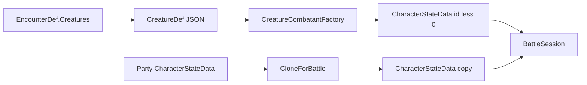

# Как использовать Creatures (статблоки противников)

**Последнее обновление:** 2026-08-11 12:45:00 (+03:00)

Практическое руководство: как описывать противников (`CreatureDef`) и превращать их в боевых combatant’ов (`CharacterStateData`) через `CreatureCombatantFactory`.

Связанные документы: [Definitions.md](Definitions.md) (`CreatureDef`, `EncounterDef`), [State.md](State.md) (`CreatureCombatantFactory`, `CharacterStateData`), [Battle.md](Battle.md) (combatants / session / encounter), [Feats.md](Feats.md) (Apply/Unapply на том же shape).

---

## Идея в одном абзаце

`CreatureDef` — **авторский статблок** (как в руководстве по монстрам): identity/meta, `AC`/`HP`/`Speed`/`Size`, числовые статы в `Parameters` (как у персонажей), экип, `BattleActionIds`, `ChallengeRating`.  
В бою партия и противники — **один и тот же** `CharacterStateData`, чтобы `ApplyFeat` / `UnapplyFeat` / `EndCharacterTurn` / proxies работали одинаково.  
Связка: `CreatureDef` → **`CreatureCombatantFactory.CreateFromCreature`** → session-`CharacterStateData` с **отрицательным** id.  
Состав пачки врагов — отдельный `EncounterDef` (список id существ).



---

## Базовый API

| Вызов | Когда |
|-------|--------|
| `CreatureCombatantFactory.CreateFromCreature(def, instanceId, definitionsManager)` | Спавн NPC из статблока; `instanceId < 0` |
| `CreatureCombatantFactory.CloneForBattle(partyMember)` | Копия героя в session (не мутировать сейв mid-combat) |
| `CharacterParametersOperator.ApplyFeat(combatant, featId, …)` | Статусы / дебафы — **и** на игрока, **и** на NPC |
| `definitionsManager.Creatures[id]` | Lookup статблока после `LoadAll` |
| `definitionsManager.Encounters[id]` | Lookup состава боя после `LoadAll` |

Factory **не** пишет в `CharactersStateData` профиля и **не** трогает `NextCharacterId`.

---

## Пример использования (C#)

```csharp
// 1) Противник из статблока (session id: -1, -2, …)
CreatureDef goblinDef = definitionsManager.Creatures["_GoblinWarrior"];
CharacterStateData goblin = CreatureCombatantFactory.CreateFromCreature(
    goblinDef,
    instanceId: -1,
    definitionsManager);

// 2) Копия члена партии для боя
CharacterStateData heroInBattle = CreatureCombatantFactory.CloneForBattle(
    state.Characters.Characters[heroId]);

// 3) Тот же Write API статусов для обеих сторон
CharacterParametersOperator.ApplyFeat(goblin, "_ConditionFrightened", definitionsManager);
CharacterParametersOperator.ApplyFeat(heroInBattle, "_ConditionFrightened", definitionsManager);

// 4) Чтение итогов (MaxHP / навыки) через proxy — как у героя
var proxy = new CharacterParametersProxy(goblin, ruleDef, definitionsManager);
int maxHp = proxy.GetTotalValue(Glossary.Characters.MAX_HIT_POINTS);
int stealth = proxy.GetTotalValue(Glossary.Characters.STEALTH);

// 5) Действия NPC — с дефа (не копируются в CharacterStateData)
List<string> actions = goblinDef.BattleActionIds; // например "_Strike"

// 6) Состав боя из EncounterDef
EncounterDef encounter = definitionsManager.Encounters["_RoadsideAmbush"];
foreach (string creatureId in encounter.Creatures)
{
    // CreateFromCreature(definitionsManager.Creatures[creatureId], ...)
}
```

---

## Контракт полей `CreatureDef`

| Поле | Назначение |
|------|------------|
| `Disabled`, `Tags` | Контентные флаги / метки |
| `Avatar`, `Name` | Предпочитаемые identity-поля (как у персонажей / прегенов) |
| `Icon`, `Title` | Legacy fallback для avatar/name |
| `Description` | Описание / ключ локализации (не runtime combat) |
| `ChallengeRating` (`float`) | Класс опасности / encounter-budget; **не** пишется в `CharacterStateData.Parameters` |
| `Size`, `Speed`, `ArmorClass`, `HitPoints` | Базовые combat-поля статблока |
| `BattleActionIds` | Id `BattleActionDef`; остаются на дефе |
| `EquippedItems`, `Spells` | Экип / заклинания (как у персонажа) |
| `Parameters` | Основное числовое хранилище (как у `CharacterStateData`); пассивки/бонусы тоже сюда, без отдельного `Features` |
| `Ancestry`, `Class`, `Background`, `Gender` | Опциональный flavor |
| `StatusEffects` | Стартовые таймеры Condition (как у `CharacterStateData`) |

### Что класть в `Parameters`

Числовые статы, которые раньше жили отдельными полями (`Abilities` / `Perception` / `Saves` / `Skills` / `Level`), теперь хранятся **только** здесь:

| Ключи | Пример | Смысл |
|-------|--------|--------|
| `Level` | `1` | Уровень существа (обязателен для корректных формул) |
| Abilities | `STR`, `DEX`, `CON`, `INT`, `WIS`, `CHA` | Модификаторы характеристик |
| Saves | `Fortitude`, `Reflex`, `Will` | Authored totals; factory запекает `*.ItemsBonus` (`CON`/`DEX`/`WIS` + Untrained) |
| Perception / skills | `Perception`, `Stealth`, `Acrobatics`, … | Authored totals; factory запекает `*.ItemsBonus` |

`ChallengeRating` в `Parameters` **не** кладётся.

В TEA Creature Editor при create / `Add Default Parameters` сидятся `Level`, abilities, `Perception`, сейвы (skills — нет; добавляются вручную).

---

## Пример JSON (`CreatureDef`)

Файл: `Definitions/_ADVENTURES_/Creatures/_GoblinWarrior.json` (id = имя файла).

```json
{
  "Disabled": false,
  "Tags": ["humanoid", "goblin"],
  "Avatar": "",
  "Name": "Гоблин-воин",
  "Icon": "",
  "Title": "Гоблин-воин",
  "Description": "Тестовый гуманоидный противник с коротким мечом.",
  "ChallengeRating": 1.0,
  "Size": "Small",
  "Speed": 25,
  "ArmorClass": 16,
  "HitPoints": 6,
  "BattleActionIds": ["_Strike"],
  "EquippedItems": [
    { "Slot": "Hand", "ItemId": "_Shortsword" },
    { "Slot": "Body", "ItemId": "_HideArmor" }
  ],
  "Spells": {},
  "Parameters": {
    "Level": 1,
    "STR": 0, "DEX": 2, "CON": 1, "INT": 0, "WIS": 0, "CHA": -1,
    "Perception": 5,
    "Fortitude": 5, "Reflex": 7, "Will": 3,
    "Stealth": 7, "Acrobatics": 5
  },
  "Ancestry": "",
  "Class": "",
  "Background": "",
  "Gender": "Male",
  "StatusEffects": {}
}
```

Стартовый набор существ: `_GoblinWarrior`, `_Wolf`.  
Стартовые энкаунтеры: `_RoadsideAmbush`, `_WolfPack` (см. [Definitions.md](Definitions.md) / [Battle.md](Battle.md)).

---

## Что делает factory при CreateFromCreature

1. Создаёт `CharacterStateData` с `Id = instanceId` (ожидается `< 0`).
2. `Name` ← `Name` (fallback: `Title` → `Id`), `Avatar` ← `Avatar` (fallback: `Icon`); `Ancestry` / `Class` / `Background` / `Gender` — как в дефе.
3. Копирует `CreatureDef.Parameters` в combatant `Parameters`, затем добивает/нормализует:
   - `Level` из `Parameters.Level` (если нет — fallback `1`);
   - `AC` / `Speed` из полей дефа;
   - abilities / saves / perception / skills уже из `Parameters`;
   - текущие `HitPoints`; `MaxHitPoints.Bonus` так, чтобы `GetTotalValue(MaxHitPoints)` = авторский HP (без Class/Ancestry формула ≈ `(CON)*Level + Bonus`);
   - для authored totals `Perception` / skills / saves: `*.ItemsBonus = final − ability`, чтобы `GetTotalValue` совпал со статблоком.
4. `CharacterItemFeaturesOperator.ApplyIfWorn` для носимых слотов (`ItemDef.Features`).
5. `StatusEffects` — копируются из `CreatureDef.StatusEffects` (или пустой словарь); `BattleActionIds` **не** копируются в state.

Отдельного `CreatureDef.Features` нет: пассивные эффекты существа автор задаёт напрямую в `Parameters` (и при необходимости в `StatusEffects`).

`ChallengeRating` остаётся только на `CreatureDef` (дробные значения допустимы) и **не** записывается в `CharacterStateData.Parameters`.

`CloneForBattle` копирует mutable-блок (`Parameters`, `EquippedItems`, `Spells`, `StatusEffects`) и метаданные; id по умолчанию тот же, что у source.

---

## Контракт id и сейва

| Роль | Id | Куда писать |
|------|-----|-------------|
| Party | `> 0` (`NextCharacterId`) | `CharactersStateData` (профиль) |
| NPC в бою | `< 0` | только battle session |

После боя: итоги по партии (HP, стойкие эффекты) — обратно в профиль по правилам session→save; NPC обычно отбрасываются.

---

## Prefab / UI

Не нужны. Контент — JSON; runtime — factory + тот же State/Feats API. Encounter-состав — `EncounterDef`.

---

## См. также

- Поля дефа и загрузка: [Definitions.md](Definitions.md) (`CreatureDef`, `EncounterDef`)
- Factory и Read/Write API: [State.md](State.md)
- Боевая модель сторон: [Battle.md](Battle.md)
- Статусы на combatant: [Feats.md](Feats.md)
