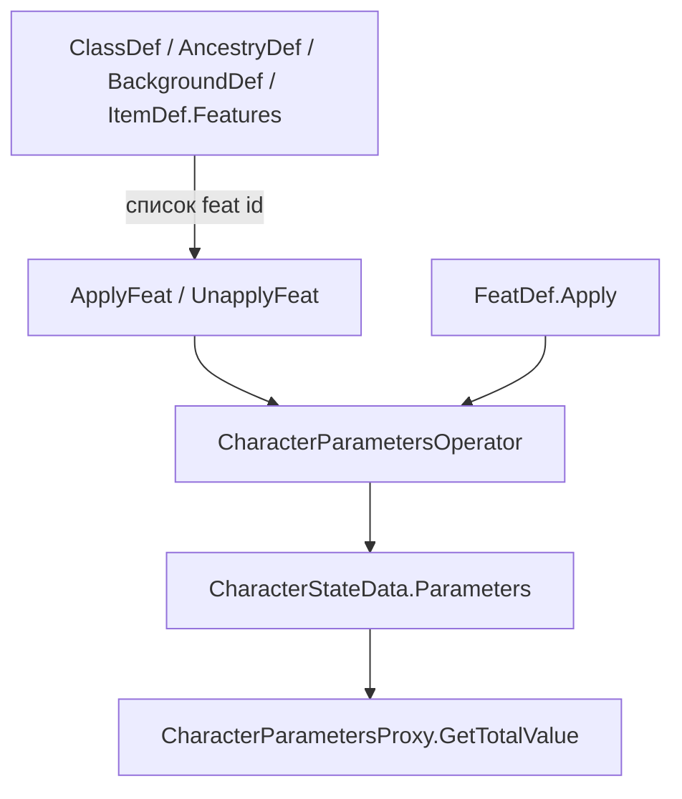
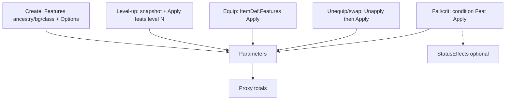

# Как использовать Feats

**Последнее обновление:** 2026-07-27 18:12:08 (+03:00)

Практическое руководство: когда и как применять / снимать черты (`FeatDef`) к персонажу через Write API.

Связанные документы: [Definitions.md](Definitions.md) (`FeatDef`, `CharacterParamsPatchData`, `Features` на дефах), [State.md](State.md) (`CharacterParametersOperator`, прокачка, экипировка), [Battle.md](Battle.md) (бой — прототип).

---

## Идея в одном абзаце

`FeatDef` — **статический** эффект в контенте (`Apply`: `Add` / `Set` / `AlsoApplyFeatIds`).  
В runtime эффект попадает в сырые `CharacterStateData.Parameters` только через **`CharacterParametersOperator.ApplyFeat` / `UnapplyFeat`** (или `ApplyPatch` / `UnapplyPatch`).  
Итоги вроде `MaxHitPoints` / навыков **не пишутся** в словарь — их читает `CharacterParametersProxy.GetTotalValue`.



---

## Базовый API

| Вызов | Когда |
|-------|--------|
| `ApplyFeat(parameters\|character, featId, definitionsManager)` | Выдать черту / feature персонажу |
| `UnapplyFeat(...)` | Снять ту же черту (симметричный откат патча) |
| `ApplyPatch` / `UnapplyPatch` | Ручная правка без отдельного `FeatDef` (boost при прокачке и т.п.) |
| `CreateCharacterRequestSnapshot(character)` | Слепок mutable-блока перед прокачкой |

Семантика патча:

| Поле | Apply | Unapply |
|------|-------|---------|
| `Add` | `+= value` | `+= -value` |
| `Set` | `= value` | ≠0 → `0`; `0` → `1` |
| `AlsoApplyFeatIds` | каскад Apply (прямой порядок) | каскад Unapply (обратный порядок) |

Обёртки на слепке прокачки: `CharacterRequestData` / `UpdateCharacterRequestData` — те же `ApplyFeat` / `UnapplyFeat` / `ApplyPatch` / `UnapplyPatch`.

---

## 1. Создание персонажа: ancestry / background / class

Контент уже ссылается на feat id:

| Источник | Поле | Форма |
|----------|------|--------|
| `AncestryDef` | `Features` | `Dictionary<int, List<string>>` — уровень → id |
| `ClassDef` | `Features` | то же |
| `BackgroundDef` | `Features` | `List<string>` (обычно «с 1 уровня») |

**Поток (целевой):** при финализации создания собрать стартовый `CharacterRequestData.Parameters`, затем последовательно `ApplyFeat` для всех выдаваемых id (ancestry lvl 1, background, class lvl 1, выбран игрока из `Options`), затем `CreateCharacterStateAction`.

Пример (упрощённо):

```csharp
var characterData = new CharacterRequestData
{
    Parameters = new Dictionary<string, int>
    {
        // базовые сырые ключи до черт: Level, abilities-скелет и т.д.
        [Glossary.Characters.LEVEL] = 1,
    },
};

// Background: плоский список
foreach (string featId in backgroundDef.Features)
    characterData.ApplyFeat(featId, definitionsManager);

// Ancestry / Class: features 1-го уровня
if (ancestryDef.Features != null
    && ancestryDef.Features.TryGetValue(1, out List<string> ancestryFeats))
{
    foreach (string featId in ancestryFeats)
        characterData.ApplyFeat(featId, definitionsManager);
}

if (classDef.Features != null
    && classDef.Features.TryGetValue(1, out List<string> classFeats))
{
    foreach (string featId in classFeats)
        characterData.ApplyFeat(featId, definitionsManager);
}

// Черта с Options (например Key Attribute): игрок выбрал один id
characterData.ApplyFeat(playerChosenOptionFeatId, definitionsManager);

stateLogic.ProcessAction(new CreateCharacterStateAction(new CreateCharacterRequestData
{
    Name = name,
    Ancestry = ancestryDef.Id,
    Class = classDef.Id,
    Background = backgroundDef.Id,
    CharacterData = characterData,
    AddToActiveParty = true,
}));
```

**Unapply** при создании обычно не нужен: игрок ещё не «снял» черту. Если в UI отменяют выбор option-feat до подтверждения — вызовите `UnapplyFeat` на том же слепке.

Черты с пустым / отсутствующим `Apply` (чисто narrative / choice-обёртки вроде `_FighterFeat1`) — `ApplyFeat` сделает warning и no-op по патчу; смысл таких id — выбор дочернего feat из `Options`.

---

## 2. Новый уровень (прокачка)

Контракт: только через слепок + `UpdateCharacterStateAction` (экшен **не** крутит Apply сам — персистит готовый `CharacterData`).

```csharp
CharacterStateData character = state.Characters.Characters[characterId];

var request = new UpdateCharacterRequestData
{
    CharacterId = characterId,
    CharacterData = CharacterParametersOperator.CreateCharacterRequestSnapshot(character),
};

// 1) поднять сырой Level (ручной патч или отдельный feat-boost)
request.ApplyPatch(new CharacterParamsPatchData
{
    Add = new Dictionary<string, int> { [Glossary.Characters.LEVEL] = 1 },
}, definitionsManager);

int newLevel = request.CharacterData.Parameters[Glossary.Characters.LEVEL];

// 2) feats класса / ancestry на этот уровень
if (classDef.Features != null
    && classDef.Features.TryGetValue(newLevel, out List<string> levelFeats))
{
    foreach (string featId in levelFeats)
    {
        // choice-feat: вместо id-обёртки Apply выбранный Options-id
        if (IsChoiceWrapper(featId, out string chosenChildId))
            request.ApplyFeat(chosenChildId, definitionsManager);
        else
            request.ApplyFeat(featId, definitionsManager);
    }
}

// 3) ручные boosts (какие параметры качать)
request.ApplyPatch(playerAbilityBoostPatch, definitionsManager);

stateLogic.ProcessAction(new UpdateCharacterStateAction(request));
```

Откат выбора в UI прокачки до `ProcessAction`: `request.UnapplyFeat(...)` / `UnapplyPatch` на том же слепке.

---

## 3. Инвентарь / экипировка персонажа

У `ItemDef` есть `Features` (`List<string>` — id `FeatDef`).  
Проводка в state-actions: `CharacterItemFeaturesOperator` внутри Equip / Unequip / Move / Remove (в конструктор передаётся `DefinitionsManager`).

**Правило Bag:** Features действуют только на **носимых** слотах (`Hand`, `Body`, `Finger`, `Neck`, `Tail`, …). Слот `Bag` — это «карман» на персонаже: предмет там **не** бафает. Хелпер: `Glossary.Items.GrantsItemFeatures(slot)`.

| Событие | Действие |
|---------|----------|
| `EquipItemFromInventory` в носимый слот | Unapply старого (если был) → Apply нового |
| `EquipItemFromInventory` в `Bag` | Features не трогать |
| `UnequipItemToInventory` / `RemoveCharacterEquippedItem` с носимого | Unapply |
| `MoveEquippedItemBetweenSlots` носимый → `Bag` | Unapply |
| `MoveEquippedItemBetweenSlots` `Bag` → носимый | Apply |
| Move между двумя носимыми | Features не трогать |
| `AddCharacterItem` (только `Bag` / общий инвентарь) | Features не применять |
| Предмет только в общем `Inventory.Items` | Features не применять |

Слоты украшений (`Finger`, `Neck`, `Tail`) задаются обычно в `AncestryDef.EquippedItems`; оружие/броня/`Bag` — в `ClassDef.EquippedItems`.

Пример вызова:

```csharp
stateLogic.ProcessAction(new EquipItemFromInventoryStateAction(
    new EquipItemFromInventoryRequestData
    {
        CharacterId = characterId,
        SlotIndex = neckSlotIndex,
        ItemId = "_AmuletOfMightyFists",
    },
    definitionsManager));
```

Бафы/дебафы предмета описывайте обычным `FeatDef.Apply` (например `Add: { "Athletics.ItemsBonus": 1 }` или `MaxHitPoints.Bonus`).

---

## 4. Бой / провал проверки: критический эффект и статус

Предпосылка: **временный или условный эффект** тоже оформляется как `FeatDef` (часто `ClassFeature` / отдельный «condition feat»). Геймплей в нужный момент вызывает `ApplyFeat`; при окончании эффекта — `UnapplyFeat`.

Типичные триггеры (целевые):

- крит / провал спасброска / провал skill check в adventure;
- боевой outcome (`BattleActionDef` / реакция) — см. [Battle.md](Battle.md);
- истечение длительности раунда → Unapply.

### Как Feat «ссылается» на дебаф / статус

Сейчас `CharacterParametersOperator` меняет только **`Parameters`**. Словарь `CharacterStateData.StatusEffects` — отдельное хранилище. Рекомендуемый контентный паттерн:

1. **Condition-feat** с `Apply.Set` / `Add` сырых ключей (штрафы, флаги), которые читают restrictions / формулы / бой.
2. При необходимости каскад: `AlsoApplyFeatIds` → более мелкие эффекты.
3. В **том же** обработчике триггера (бой / проверка) дополнительно пишите статус в `StatusEffects`, если нужна отдельная UI/таймер-семантика:

```csharp
// Провал проверки → наложить «Испуган» на персонажа
const string FEAR_FEAT_ID = "_ConditionFrightened";
const string FEAR_STATUS_ID = "Frightened";

CharacterParametersOperator.ApplyFeat(character, FEAR_FEAT_ID, definitionsManager);

character.StatusEffects ??= new Dictionary<string, int>();
character.StatusEffects.TryGetValue(FEAR_STATUS_ID, out int rank);
character.StatusEffects[FEAR_STATUS_ID] = rank + 1;

// Позже, когда эффект спадает:
CharacterParametersOperator.UnapplyFeat(character, FEAR_FEAT_ID, definitionsManager);
if (character.StatusEffects.TryGetValue(FEAR_STATUS_ID, out int current) && current <= 1)
    character.StatusEffects.Remove(FEAR_STATUS_ID);
else if (character.StatusEffects.ContainsKey(FEAR_STATUS_ID))
    character.StatusEffects[FEAR_STATUS_ID] = current - 1;
```

Пример JSON condition-feat (иллюстрация):

```json
{
  "Type": "ClassFeature",
  "Level": 0,
  "Title": "Испуган",
  "Description": "Штраф к проверкам; снимается UnapplyFeat / снижением ранга статуса.",
  "Apply": {
    "Add": {
      "Perception": -1
    },
    "Set": {
      "_ConditionFrightened": 1
    }
  }
}
```

> **Важно:** ключи вроде `"Perception": -1` в `Add` меняют **сырое** значение. Если `Perception` считается формулой в `RuleDef.ParameterFormulas`, кладите штраф в согласованный сырой ключ (например `Perception.Bonus` / отдельный status-ключ) — иначе ломаете контракт «итог только через proxy». Для MVP condition-feat лучше трогать только сырые ключи без формул или ключи с суффиксами `.Bonus` / `.ItemsBonus`.

Персистентность: если эффект должен пережить выход из боя — меняйте state через state-action (или батч прокачки/обновления), а не только runtime-сессию. Эфемерные боевые счётчики по [Battle.md](Battle.md) могут жить вне сейва — тогда Apply/Unapply на копии персонажа в session, без записи в профиль.

---

## 5. Краткая шпаргалка «когда что вызывать»

| Ситуация | Apply | Unapply |
|----------|-------|---------|
| Выбрали ancestry / background / class feature | да, по спискам `Features` | при отмене выбора в UI |
| Выбрали option у feat с `Options` | Apply **выбранного** child id | отмена выбора |
| Новый уровень | Apply feats этого уровня (+ ручные `ApplyPatch`) | правка слепка до `ProcessAction` |
| Надели предмет с `ItemDef.Features` в **носимый** слот (не `Bag`) | Apply всех Features | при снятии / переносе в `Bag` / удалении |
| Крит / провал / боевой дебаф | Apply condition-feat (+ опционально `StatusEffects`) | конец длительности / лечение / успешный save |
| Преген / чит с готовым словарём | можно не вызывать Apply, если `Parameters` уже содержат итог сырых ключей | — |

---

## Чего оператор пока не делает

- Не пишет в `StatusEffects` / `Spells` / `EquippedItems` / `FeatDef.AdditionalSlots` — только `Parameters` (слоты меняют отдельные inventory-экшены).
- Не clamp’ит текущие `HitPoints` при падении `MaxHitPoints` — при необходимости делайте в вызывающем коде после Apply/Unapply.
- `ItemDef.Features` в equip-экшенах уже подключены; create/level-up UI и бой — вызывайте ApplyFeat явно.

---

## См. также

- Контракт патча и JSON: [Definitions.md](Definitions.md) (`FeatDef`, `CharacterParamsPatchData`)
- Read / Write API и пример `UpdateCharacter`: [State.md](State.md)
- Ограничения по параметрам персонажа: [Restrictions.md](Restrictions.md)

---

## Разбор симуляции (пошагово)

Ниже — пошаговая симуляция на реальных дефах (дварф + воин + батрак) и на иллюстративных предметах/статусах. У текущих item JSON поле `Features` ещё не заполнено — кейсы C/D показывают целевой контракт.

### Общие правила симуляции

Каждый `ApplyFeat(id)`:
1. читает `FeatDef.Apply`;
2. делает `Add` (`+=`), потом `Set` (`=`);
3. каскадит `AlsoApplyFeatIds` (в стартовом контенте каскадов пока нет).

`UnapplyFeat` — наоборот: сначала каскад с конца, потом `Add` с минусом, `Set`: ненулевое → `0`, `0` → `1`.

Итог `MaxHitPoints` / `Athletics` **не лежит** в словаре — его даёт `CharacterParametersProxy` после изменения сырых ключей.



### Кейс A. Создание персонажа

**Стартовый скелет** (до черт), упрощённо — все abilities = 0, `Level = 1`:

| Ключ | Значение |
|------|----------|
| `Level` | 1 |
| `STR`…`CHA` | 0 |

#### A1. Background `_Farmhand` → `Features: ["_AssuranceAthletics"]`

Допустим у `_AssuranceAthletics` есть флаг в `Set`. После Apply:

| Ключ | Значение |
|------|----------|
| `_AssuranceAthletics` | 1 |

Если в `Apply` пусто — warning, словарь не меняется.

#### A2. Ancestry `Dwarf` level 1 → `_DwarfAttributeBoosts`

`Add: CON+1, WIS+1, CHA-1` + `Set: _DwarfAttributeBoosts=1`

| Ключ | Было | Стало |
|------|------|-------|
| `CON` | 0 | **1** |
| `WIS` | 0 | **1** |
| `CHA` | 0 | **-1** |
| `_DwarfAttributeBoosts` | — | **1** |

Дальше `_Darkvision` → только `Set: _Darkvision=1`.  
Choice-обёртки вроде `_DwarfHeritage` / `_DwarfAncestryFeat1` без `Apply` — no-op; игрок отдельно Apply’ит выбранный child из `Options`.

#### A3. Class `Fighter` level 1

Список включает `_FighterKeyAttribute` — **обёртка с Options**, без `Apply`. Игрок выбирает `_FighterKeyStrength`:

`Add: STR+1`, `Set: _FighterKeyStrength=1`

| Ключ | Было | Стало |
|------|------|-------|
| `STR` | 0 | **1** |
| `_FighterKeyStrength` | — | **1** |

`_TrainAthletics` (если выдан через initial skill):

`Set: Athletics.ProfRank=1`, `_TrainAthletics=1`

| Ключ | Стало |
|------|-------|
| `Athletics.ProfRank` | **1** (`Trained`) |
| `_TrainAthletics` | **1** |

#### A4. Persist

`CreateCharacterStateAction` кладёт **готовый** словарь `Parameters` в state.  
Proxy: `GetTotalValue("Athletics")` ≈ `STR + PROFICIENCY + ITEMS` — уже ненулевой из‑за STR и ProfRank.

### Кейс B. Повышение уровня (1 → 2, потом к 3)

Персонаж уже в state. UI:

```text
snapshot = CreateCharacterRequestSnapshot(character)
ApplyPatch(Level += 1)     // Level: 1 → 2
ApplyFeat для Features[2]  // _FighterFeat2 (choice), _SkillFeatChoice (choice)
ProcessAction(UpdateCharacter)
```

На 2 уровне у Fighter в JSON в основном **choice-обёртки** — механический Apply часто только у выбранного child.

**Переход на 3:** среди Features есть `_Bravery`:

`Set: Will.ProfRank=2`, `_Bravery=1`

| Ключ | Было | После Apply `_Bravery` |
|------|------|------------------------|
| `Level` | 3 | 3 |
| `Will.ProfRank` | 0/1 | **2** (`Expert`) |
| `_Bravery` | — | **1** |

Если в UI игрок «отменил» выбор `_Bravery` до `ProcessAction`:

`UnapplyFeat("_Bravery")` → `Will.ProfRank=0`, `_Bravery=0` (инверсия `Set`).

Wholesale `UpdateCharacter` потом просто записывает слепок как есть.

### Кейс C. Экипировка магического предмета

Предмет (иллюстрация; в текущих item JSON `Features` ещё нет):

```json
"_AmuletOfMightyFists": {
  "AvailableSlots": ["Neck"],
  "Features": ["_ItemBonusAthletics1"]
}
```

`_ItemBonusAthletics1.Apply`:

```json
"Add": { "Athletics.ItemsBonus": 1 },
"Set": { "_ItemBonusAthletics1": 1 }
```

**Надеть в `Neck`:** Apply Features.

| Ключ | До | После |
|------|----|-------|
| `Athletics.ItemsBonus` | 0 | **1** |
| `_ItemBonusAthletics1` | — | **1** |

**Положить в `Bag` (с `Neck` или из общего инвентаря без ношения):** Features **не** применяются / при уходе с `Neck` в `Bag` — **Unapply**.

**Снять в общий инвентарь** с `Neck` → `UnapplyFeat`.

### Кейс D. Проклятый предмет + swap / перенос в Bag

Проклятие (иллюстрация):

```json
"_CursedRingOfWeakness": {
  "AvailableSlots": ["Finger"],
  "Features": ["_CurseStrengthPenalty"]
}
```

`_CurseStrengthPenalty.Apply`: `Add: { "STR": -2 }`, `Set: { "_CurseStrengthPenalty": 1 }`

**Надели на `Finger`:** `STR` 1 → **-1**, флаг проклятия = 1.

**Перенос `Finger` → `Bag`:** `UnapplyFeat("_CurseStrengthPenalty")` → `STR` обратно, флаг → 0. В мешке кольцо «молчит».

**Swap** носимый↔носимый (например два `Finger`): Unapply старого в целевом слоте (если был) → Apply нового; уходящий в другой носимый слот Features сохраняет (или при полном swap — симметрично пересчитать оба).

**Swap** носимый ↔ `Bag`: уходящий в `Bag` — Unapply; приходящий из `Bag` в носимый — Apply.

### Кейс E. Провал проверки / боевой дебаф

Триггер: провал Will save → condition-feat `_ConditionFrightened`:

```json
"Add": { "Perception.Bonus": -1 },
"Set": { "_ConditionFrightened": 1 }
```

| Шаг | Parameters | StatusEffects (отдельно) |
|-----|------------|--------------------------|
| До | … | — |
| `ApplyFeat("_ConditionFrightened")` | `Perception.Bonus` -= 1, флаг = 1 | вызывающий код: `Frightened = 1` |
| Конец эффекта `UnapplyFeat` | Bonus += 1 (обратно), флаг = 0 | `Frightened` remove / −1 |

Оператор **сам** `StatusEffects` не трогает — только `Parameters`. Статус в UI/таймер пишется рядом в том же handler’е.

### Кейс F. Откат ошибочного Apply (симметрия)

Было после `_DwarfAttributeBoosts`: `CON=1, WIS=1, CHA=-1`.

`UnapplyFeat("_DwarfAttributeBoosts")`:

| Ключ | Расчёт | Стало |
|------|--------|-------|
| `CON` | 1 + (−1) | **0** |
| `WIS` | 1 + (−1) | **0** |
| `CHA` | −1 + (−(−1)) = −1+1 | **0** |
| `_DwarfAttributeBoosts` | Set был 1 → | **0** |

Словарь вернулся к состоянию до этой черты (если других патчей на те же ключи не было).

### Сводка: где крутится Apply и как попадает в сейв

| Кейс | Где крутится Apply | Как попадает в сейв |
|------|--------------------|---------------------|
| Создание | на `CharacterRequestData` до Create | `CreateCharacterStateAction` |
| Уровень | на слепке `UpdateCharacterRequestData` | `UpdateCharacterStateAction` wholesale |
| Экипировка | `CharacterItemFeaturesOperator` в Equip/Unequip/Move/Remove | тот же state-action |
| Бой/проверка | на живом `CharacterStateData` или session-копии | отдельный state-action / эфемерно |
